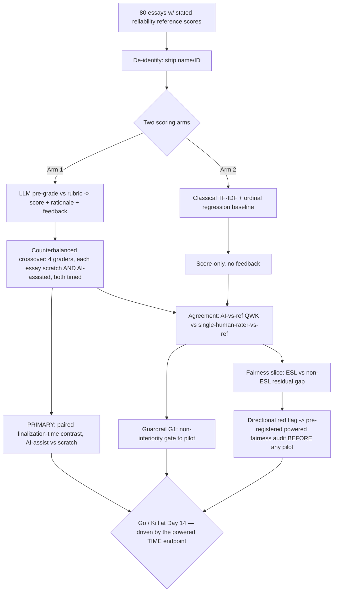

# AI-Assisted Rubric Pre-Grading with Instructor-in-the-Loop (GradeAssist) — Ideation Package

## Section 1: Nature of the Problem

This sits primarily in the **"Augment expert judgment under volume pressure"** Section-1 category, with a secondary footing in **"Reduce process variance / inconsistency."** It is **AI** in the narrow, correct sense: the core task — reading a free-text essay and mapping it to a multi-dimensional rubric with a defensible rationale — requires natural-language *understanding* and generation that classical rules and analytics cannot produce. It is explicitly **not** pure Automation (no fixed deterministic logic suffices for open-ended prose) and **not** pure Analytics (we are not aggregating structured numbers; we are interpreting unstructured text against semantic criteria). One sentence: *This is an AI problem because the unit of work is "judge unstructured argumentative prose against a qualitative rubric and explain why," which is irreducibly a language-understanding task — but only the pre-grade is AI; the grade decision stays human.*

## Section 1.1: Business Problem (SWAT "So-What")

**Business goal (cost side):** In a large-enrollment program (say a 1,200-student gateway course with 4 written assignments/term), grading is the single largest variable instructional-labor cost and the #1 driver of TA headcount and grade-appeal overhead. **So-what:** if grading throughput per qualified human-hour does not improve, the program either caps enrollment (lost tuition revenue) or degrades feedback quality (lower retention, more appeals, accreditation risk).

**Specific problem:** Human graders (TAs + instructor) currently spend ~12 minutes per essay, disagree with each other meaningfully (inter-rater quadratic-weighted kappa typically 0.55–0.70 in published rubric-grading studies), and under time pressure write thin feedback (often 1–2 generic sentences).

- **Success definition (for the *business case*, tested in prototype):** AI pre-grading lets a human finalize an essay in ≤5 min (≥55% time reduction) — **the primary, powered claim** — while two *guardrail* conditions hold: provisional scores are *non-inferior to a single human rater* against the stated-reliability reference, and no directional fairness red flag fires against the ESL slice.
- **Failure definition (primary):** time saved <25% (the human still re-reads everything). **Guardrail failures** (agreement below a single human rater; a flagged ESL gap) do not by themselves prove the *value* false — they gate the path to pilot, as defined in Prototype Metrics.
- **Timeframe:** 2-week prototype window; business decision (go/kill) at day 14.
- **Scope:** ONE assignment type (argumentative essay, ~500–800 words) in ONE course. Not problem sets, not code, not multi-modal. Deliberately narrow.
- **Metrics:** see Prototype Metrics.

## Section 2: End Users & Expected Workflow

**Primary user:** the *grading human* — a TA or the instructor. **Secondary user:** the instructor as *grade owner and appeal authority*. **Tertiary:** the student (receives feedback, can appeal). The AI's output is a **draft the human edits**, never a published grade.

**Workflow (numbered):**
1. Student submissions land in the LMS (Canvas/Blackboard) assignment.
2. System pulls submission text + the instructor's rubric (already authored in the LMS) and de-identifies (strips name, ID).
3. AI produces, per submission: a **provisional score per rubric dimension**, an **overall provisional score**, a **rationale tied to specific rubric language**, **2–3 targeted feedback comments**, and a **confidence flag** (low confidence → routed first to human).
4. TA opens a side-by-side review screen: submission | AI draft. TA accepts, edits, or overrides any dimension; every change is logged.
5. Any score in the bottom band (e.g., fail/low) is **force-routed to the instructor** for sign-off before release — AI never finalizes an adverse grade.
6. Instructor batch-approves; grades + feedback publish to LMS.
7. Appeals route to instructor with the AI rationale + edit history attached for transparency.

**Example AI-generated output (one submission, rubric dimension = "Use of Evidence", scale 1–6):**

> **Provisional: Evidence = 4/6 (Overall 4/6). Confidence: High.**
> *Rationale:* "The essay cites two sources (paragraph 2: the 2019 census figure; paragraph 4: the Smith interview) and ties the census figure directly to the thesis on urban migration — meeting rubric level 4 ('relevant evidence, mostly integrated'). It does not reach level 5–6 because the Smith interview is quoted but not analyzed (rubric requires 'evidence interpreted, not just presented')."
> *Targeted feedback to student:* "Strong use of the census data. To push this higher, explain *why* the Smith interview supports your claim — right now it's stated but not interpreted."
> *Flag for human:* none.

## Section 3: Business & ROI Evaluation

**How it's done today:** 100% manual. TAs grade against a rubric; the instructor spot-checks ~10% and adjudicates appeals. No AI. **Current performance:** ~12 min/essay; inter-rater QWK ≈ 0.60 (published rubric-grading baselines); feedback length thin and inconsistent; appeal rate ~3–5% of grades.

**Two baseline numbers the ROI rests on are treated as a PRE-READ to establish, not asserted:**
- **12 min/essay** — basis: (a) published rubric-grading time studies for argumentative essays, and (b) a **1-hour pre-read** in which each participating grader times themselves scratch-grading 5 course essays. We use the *measured per-grader* baseline, not a literature constant, because grader speed varies (see Prototype Design). Until the pre-read runs, treat 12 min as *Likely*, not *Established*.
- **$30/hr blended grader cost** — basis: the department's actual TA pay scale plus the instructor-time fraction, fully loaded. Marked **to-confirm from the department budget line** before the ROI is quoted to finance; used here as a placeholder of the right order of magnitude.

**Quantified ROI — explicit Fermi build-up (every assumption stated and labeled):**

*Cost-savings side (the defensible core):*
- A1 [assumption]: 1,200 students × 4 written assignments/term = **4,800 essays/term**.
- A2 [pre-read, to measure]: current grading time = **~12 min/essay** → 960 human-hours/term.
- A3 [hypothesis under test — the PRIMARY powered endpoint]: with AI draft, human review = **5 min/essay** → 400 hours/term. **Saved = 560 hours/term**.
- A4 [to-confirm from budget]: blended grader cost = **$30/hr** (TA + instructor mix, fully loaded).
- A5 [derived]: gross labor saving = 560 × $30 = **$16,800/term**, ≈ **$50,400/yr** (3 terms).
- A6 [cost of the tool]: 4,800 essays × ~6,000 tokens round-trip × 3 terms ≈ 86M tokens/yr; at a conservative **$10 / 1M tokens** blended ≈ **$864/yr** in inference. Add ~$5k one-time integration + ~$3k/yr maintenance.
- A7 [derived net]: Year-1 net ≈ $50,400 − $864 − $3,000 − $5,000 = **~$41,500**; steady-state ≈ **~$46,500/yr** for ONE course.

*Revenue/strategic side (flagged as softer):*
- B1 [analysis, Likely]: capacity freed (560 hrs) lets the program raise the per-TA enrollment cap; even one avoided TA line (~$8k/term) compounds the saving.
- B2 [analysis, Speculative]: better/faster feedback is associated with higher persistence; a 1-point retention bump on 1,200 students at ~$3k marginal tuition each is large but **not** claimed as primary justification — flagged speculative because the prototype does not test retention.

**Strongest argument against my own ROI (unprompted counterargument):** The $50k assumes the 5-min review target holds *and* that it isn't an artifact of who graded. If reviewers, distrusting the AI, still read the full essay *plus* the AI draft, review time could *rise* to 13–14 min and ROI goes **negative**. A subtler trap: the prototype's time number could be driven by one fast grader or by graders going faster *because they are being timed* (Hawthorne). That is exactly why the time endpoint is run as a **counterbalanced within-grader crossover** (Prototype Design), not a 2-person spot check — so the saving is a paired contrast that survives grader-speed variance and treats both arms identically under the timer.

## Section 4: Data & Integration

**Specific data items (no vague terms):**
- Submission text (plain UTF-8, 300–1,200 words).
- The instructor's rubric: dimension names, level descriptors, point ranges (structured JSON).
- **Reference ("gold") scores** per dimension + overall (integers, 1–6) for the eval set — *plus the two underlying rater scores*, retained so the reference's own reliability can be computed and reported (see Data Document).
- Grader identity (TA id, hashed) — for inter-rater variance and for the crossover counterbalancing.
- Optional fairness covariates for the *test only*: ESL flag (self-declared), section id. **Not** used as model input — used only to slice results.

**Data cleanliness rating: 4/5.** Reason: LMS submission text and rubrics are well-structured and machine-readable; reference scores already exist from real grading and carry their two rater scores. The −1 is because ESL/segment labels are self-reported, sometimes missing (~15%), and rubric wording varies in specificity across instructors.

**Deployment model:** LMS-embedded (LTI 1.3 tool), AI inference via a **business-tier API with zero data-retention / no-training contractual terms** (FERPA-compatible), de-identification at the boundary. Human-in-the-loop UI is the product surface; AI is a stateless pre-grade service. Prototype runs **offline/batch on de-identified exports** — no live LMS write-back.

## Data Document

**Primary public proxy (for the prototype, no student PII):**
- **ASAP-AES (Hewlett "Automated Student Assessment Prize") essay dataset** — Kaggle, `asap-aes`. **Volume:** ~12,978 essays across 8 prompts; **format:** TSV with essay text + resolved human scores **and the two individual rater scores**. **Access:** public Kaggle download. **PII/sensitivity:** already anonymized (named entities replaced with @PERSON, @LOCATION); **low sensitivity.** Use prompts with a clear analytic rubric (e.g., Set 7/8).
- **Secondary proxy:** **ASAP-SAS (Short Answer Scoring)** — ~17k short responses with rubrics; for the short-answer variant.
- **Fairness slicing proxy:** ASAP lacks a clean ESL flag, so for the bias slice use a **text-length / readability-band proxy** (Flesch-Kincaid bands as a stand-in for register), and supplement with a small instructor-provided real de-identified set (~20 essays, ~10 ESL / ~10 non-ESL) under IRB/FERPA cover for the directional bias check specifically.
- **Internal real data (gated):** 50–100 already-graded essays from the target course, **de-identified**, with reference scores and ESL/section labels. Sensitivity: **high** (FERPA) → de-identify, no retention, instructor-supervised.

**How the gold reference is constructed, and its own reliability (the ruler is not ground truth):**
- The reference is **not** treated as truth. For ASAP, the reference = the dataset's **resolved/adjudicated score**; its reliability is the **rater1–rater2 QWK on the exact prompt set we use**, which we **compute and report from the released script** (published values for these sets fall ≈ 0.6–0.7). That number is the noise floor against which all agreement claims are read.
- For the ~20 real course essays, the reference is built by **two independent instructor raters scoring blind, with a third adjudicating disagreements >1 point**; we **report the two raters' QWK** before adjudication. If that QWK is below ~0.6, the reference is too noisy to support any agreement claim and we say so rather than reporting a misleadingly precise number.
- Consequence for interpretation: because the ruler carries ~0.3–0.4 of disagreement, an AI cannot agree with it more tightly than two humans do. So we **do not** ask "does AI match true quality" — we ask "does AI agree with this stated-reliability reference *at least as well as a single held-out human rater does*." (See Prototype Metrics; this also removes the earlier circular phrase "controlling for true quality" — there is no true quality, only the noisy reference.)

## Prototype Design

**Primary hypothesis — ONE statistically-powered endpoint (falsifiable):**
> *On argumentative essays graded against a fixed rubric, an LLM pre-grade reduces human finalization time to ≤5 min/essay (≥55% vs the measured scratch baseline), in a counterbalanced within-grader crossover that controls for grader-speed variance, Hawthorne, and timer effects.*

This single endpoint **is** the value/ROI claim. If it fails at threshold, the business case — not the technology — is falsified.

**Guardrail conditions (gate the path to pilot; not co-equal kill clauses):**
> *G1 — Agreement non-inferiority:* AI-vs-reference QWK on the 80 essays is **not meaningfully below** a single held-out human rater's QWK against the *same* reference (reliability of that reference reported, per Data Document).
> *G2 — Fairness red flag:* the ESL-vs-non-ESL mean-residual gap point estimate stays ≤ 0.3; a larger point estimate is a **directional red flag**, not a kill (the ~20-essay slice cannot statistically support a kill — see Statistical Power note).

**Cheap / dirty / disposable test design (fail-fast):**
- **N = 80 essays** with existing reference scores (60 ASAP public + 20 real de-identified course essays for the bias slice). Small N on purpose.
- LLM grades **blind** (no access to reference, no student identity), via a single rubric-in-prompt call. No fine-tuning, no pipeline, no UI build — a **notebook + spreadsheet**.
- **Human-in-the-loop arm — counterbalanced crossover (the fix for "N=2 graders"):** **4 graders**, not 2. Timed time-study runs on a **40-essay subset**; each of those essays is graded **both ways** — scratch and AI-assisted — by **different** graders, with grader×arm and order balanced (Latin-square style) so no grader sees the same essay twice. This yields ~80 *paired* timed gradings in which the scratch-vs-assisted contrast is *within grader and within essay*, removing the single-fast-grader and essay-difficulty confounds. Both arms are timed and observed identically, so any Hawthorne/timer effect cancels in the contrast.
- **Right-tool check (run as a cheap A/B):** also score the same 80 with a **classical baseline** — TF-IDF + linear/ordinal regression (the published ASAP-era approach). If the classical model matches the LLM on agreement at 1/100th the cost, **we do not use the LLM** for scoring (LLM may still be used only for the free-text feedback). This guards against LLM-overuse.
- Total cost: **<$50 inference + ~10–12 person-hours** (4 graders × ~20 timed gradings each, plus the 1-hour baseline pre-read). Disposable: thrown away whether it passes or fails.

**WHY THIS IS A PROTOTYPE, NOT A PRODUCT:** It writes to a spreadsheet, not the LMS — no LTI integration, no auth, no roster sync, no grade write-back, no scaling, no UI beyond a side-by-side view, no error handling, no logging beyond the eval. It tests **one assignment type in one course on 80 essays** and is designed to be **deleted on day 14**. It validates the *business case* ("does a draft-then-edit workflow actually save trustworthy human time?") — not the technology ("can an LLM score essays?", which is already known from ASAP). Going to 4 graders and a crossover is **not** scope inflation — it is the minimum design that lets the *one* number the ROI depends on survive a confound; it adds graders and a pre-read, not infrastructure. A product would add FERPA-grade integration, appeal workflows, monitoring, and rubric-authoring tooling; the prototype intentionally has none of that.

## Prototype Metrics

**PRIMARY metric — the value claim, and the only statistically-powered hard kill:**
- **Net human grading time per essay**, as a **paired within-grader contrast** (AI-assisted minus scratch) on the 40-essay timed subset. Target: **≤5 min vs the measured ~12 min baseline (≥55% reduction)**. This, not accuracy, creates the $50k ROI — an accurate model nobody saves time with has zero business value.
- Secondary business metric: **% of AI drafts accepted with ≤1 dimension edited** (proxy for trust/usefulness). Target ≥60%.

**GUARDRAIL metric G1 — agreement, framed as non-inferiority to a single human rater (not "match true quality"):**
- **Quadratic-weighted kappa (QWK)** between the AI overall score and the **stated-reliability reference**, computed on the 80, **reported with its bootstrap 95% CI** from the released script, alongside a **single held-out human rater's QWK against the same reference**. Read as: *is AI non-inferior to one human?* — not *is AI correct in some absolute sense*.
- **Within-1-point agreement rate** (1–6 scale), reported with CI. Indicative target: **≥75%**.

**GUARDRAIL metric G2 — fairness, as a directional red flag (see Power note for why it cannot be a kill at N=20):**
- Mean AI-vs-reference residual gap between ESL and non-ESL slices, compared **at matched reference-score levels** (so the gap is not an artifact of the two groups sitting at different score bands). Target point estimate: **|gap| ≤ 0.3**; reported **with its 95% CI**.

**Statistical Power / MDE note (added — covers the time metric and the fairness slice):**
- **Time (primary):** the crossover yields ~80 *paired* timed gradings across 4 counterbalanced graders. Taking a per-essay grading-time SD ≈ 3 min (to be confirmed in the pre-read), the paired-comparison **MDE at 80% power is ≈ 1.2–1.5 min**. The target effect (~7 min, 12→5) is ~5× the MDE, so this endpoint is **adequately powered to support a hard kill**. If the pre-read shows SD materially above ~5 min, we add graders before committing to the kill line.
- **Fairness (guardrail):** ~10 ESL vs ~10 non-ESL. With residual SD ≈ 0.8 pt, the SE of the gap ≈ 0.36 and the **95% CI half-width ≈ ±0.7 pt** — wider than both the 0.3 target and the 0.5 concern line. The slice therefore **cannot reliably distinguish** a real 0.5 gap from zero. Powering a true 0.5-gap kill at 80% power needs **~80/group (~160 essays)** — outside the prototype budget. So fairness is **demoted from a hard kill to a directional red flag**: a flagged gap **triggers a pre-registered, powered fairness audit (~160 matched essays) before any pilot**, and the prototype does not pretend the ~20-essay number can kill or clear the project on its own. This is the more honest design and preserves fail-fast.
- **Agreement (guardrail):** N=80 gives a QWK 95% CI of roughly **±0.08–0.12** (bootstrapped). Enough to catch gross non-inferiority failure; reported as a CI, not asserted as a point.

**KILL / GATE thresholds (what each metric is actually allowed to do):**
- **HARD KILL (powered) — time:** human finalization time **≥ 9 min/essay** in the paired contrast (<25% saving → ROI does not clear A6/A7 costs and overhead). This is the one threshold the design is powered to fire.
- **GATE-TO-PILOT (guardrail G1) — agreement:** if AI-vs-reference QWK is **clearly below** the single-human-rater benchmark by more than the reported CI, the draft is a liability, not a starting point → **do not pilot** (redesign or kill), even if time passes.
- **DIRECTIONAL RED FLAG (guardrail G2) — fairness:** an ESL residual gap point estimate **> 0.5** does **not** kill at N=20 — it **blocks any pilot until a powered fairness audit clears it**. A passing time endpoint with a flagged gap means *proceed to audit*, never *ship*.
Net: we **kill cheaply on the time endpoint** (<$50, ~10 person-hours sunk); fairness and agreement gate the road to pilot rather than masquerading as kills the data can't support.

## Responsible-AI Surface (DARWIN-R)

- **Bias / fairness:** The fairness slice remains **first-class** — but as a **hard gate to pilot**, not a statistically-unsupportable kill at N=20. Honesty about that limit *is* the responsible move: a flagged ESL/readability gap blocks piloting until a **pre-registered, powered (~160-essay) fairness audit** clears it. Demographic covariates are **never model inputs** (used only to slice results), avoiding proxy discrimination. We also test style bias (readability bands) so the model isn't rewarding fluent prose over correct reasoning.
- **Privacy / compliance (FERPA):** De-identification at the boundary; inference under a **zero-retention, no-training** contract; prototype runs on public proxy + de-identified exports only. No student record is sent with identifiers; grader ids are hashed.
- **Explainability to stakeholders:** Every provisional score carries a **rationale tied to specific rubric language and specific essay passages** — reproducible and auditable. QWK (with its CI and the *reference's own reliability*), the paired time saving, and the fairness gap are all computed by a released script so the dean/CFO can re-run the claim and see the uncertainty, not just a point estimate. The grade-appeal packet includes the AI rationale plus the full human edit history.
- **Human authority over adverse outcomes:** The AI **never finalizes** a grade. Every grade is human-approved; every **low/failing grade is force-routed to the instructor** for explicit sign-off. The student-facing record shows the *human's* grade. Over-reliance / learning-harm risk is mitigated by (a) confidence flags that route uncertain cases to humans first, and (b) audit logs that surface "rubber-stamp" behavior (TA accepting 100% unedited) for instructor review — protecting against the failure mode where the human-in-the-loop becomes a human-in-name-only.

**Strongest counterargument to the whole idea (unprompted):** The biggest risk is *automation complacency* — that humans, handed a plausible draft, stop genuinely judging and the "human-in-the-loop" becomes theater, importing the model's errors and biases at scale with a false veneer of human authority. If true, the fairness and authority safeguards above are cosmetic. This is why the prototype measures **edit rate** and routes low-confidence and adverse grades to humans: if reviewers edit almost nothing AND agreement is only at the single-human-rater floor, that is itself a signal to **redesign, not ship** — and note the demotion above cuts the *opposite* way too, honestly: with fairness no longer a hard kill, the powered pre-pilot audit is now the *real* gate, and skipping it would be exactly the kind of complacency this section warns against.
