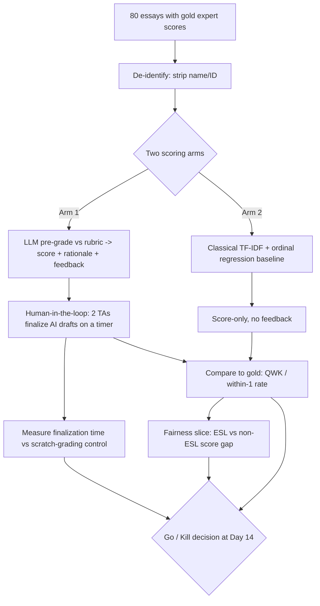

# AI-Assisted Rubric Pre-Grading with Instructor-in-the-Loop (GradeAssist) — Ideation Package

## Section 1: Nature of the Problem

This sits primarily in the **"Augment expert judgment under volume pressure"** Section-1 category, with a secondary footing in **"Reduce process variance / inconsistency."** It is **AI** in the narrow, correct sense: the core task — reading a free-text essay and mapping it to a multi-dimensional rubric with a defensible rationale — requires natural-language *understanding* and generation that classical rules and analytics cannot produce. It is explicitly **not** pure Automation (no fixed deterministic logic suffices for open-ended prose) and **not** pure Analytics (we are not aggregating structured numbers; we are interpreting unstructured text against semantic criteria). One sentence: *This is an AI problem because the unit of work is "judge unstructured argumentative prose against a qualitative rubric and explain why," which is irreducibly a language-understanding task — but only the pre-grade is AI; the grade decision stays human.*

## Section 1.1: Business Problem (SWAT "So-What")

**Business goal (cost side):** In a large-enrollment program (say a 1,200-student gateway course with 4 written assignments/term), grading is the single largest variable instructional-labor cost and the #1 driver of TA headcount and grade-appeal overhead. **So-what:** if grading throughput per qualified human-hour does not improve, the program either caps enrollment (lost tuition revenue) or degrades feedback quality (lower retention, more appeals, accreditation risk).

**Specific problem:** Human graders (TAs + instructor) currently spend ~12 minutes per essay, disagree with each other meaningfully (inter-rater quadratic-weighted kappa typically 0.55–0.70 in published rubric-grading studies), and under time pressure write thin feedback (often 1–2 generic sentences).

- **Success definition (for the *business case*, tested in prototype):** AI pre-grading lets a human finalize an essay in ≤5 min (≥55% time reduction) while final scores match a gold expert panel within ±1 point (on a 1–6 scale) at ≥75% rate, with **no** demographic/style fairness gap exceeding the kill threshold.
- **Failure definition:** time saved <30%, OR human still has to fully re-grade because AI agreement is too low to trust as a starting point, OR a measurable bias gap against ESL/segment.
- **Timeframe:** 2-week prototype window; business decision (go/kill) at day 14.
- **Scope:** ONE assignment type (argumentative essay, ~500–800 words) in ONE course. Not problem sets, not code, not multi-modal. Deliberately narrow.
- **Metrics:** see Prototype Metrics.

## Section 2: End Users & Expected Workflow

**Primary user:** the *grading human* — a TA or the instructor. **Secondary user:** the instructor as *grade owner and appeal authority*. **Tertiary:** the student (receives feedback, can appeal). The AI's output is a **draft the human edits**, never a published grade.

**Workflow (numbered):**
1. Student submissions land in the LMS (Canvas/Blackboard) assignment.
2. System pulls submission text + the instructor's rubric (already authored in the LMS) and de-identifies (strips name, ID).
3. AI produces, per submission: a **provisional score per rubric dimension**, an **overall provisional score**, a **rationale tied to specific rubric language**, **2–3 targeted feedback comments**, and a **confidence flag** (low confidence → routed first to human).
4. TA opens a side-by-side review screen: submission | AI draft. TA accepts, edits, or overrides any dimension; every change is logged.
5. Any score in the bottom band (e.g., fail/low) is **force-routed to the instructor** for sign-off before release — AI never finalizes an adverse grade.
6. Instructor batch-approves; grades + feedback publish to LMS.
7. Appeals route to instructor with the AI rationale + edit history attached for transparency.

**Example AI-generated output (one submission, rubric dimension = "Use of Evidence", scale 1–6):**

> **Provisional: Evidence = 4/6 (Overall 4/6). Confidence: High.**
> *Rationale:* "The essay cites two sources (paragraph 2: the 2019 census figure; paragraph 4: the Smith interview) and ties the census figure directly to the thesis on urban migration — meeting rubric level 4 ('relevant evidence, mostly integrated'). It does not reach level 5–6 because the Smith interview is quoted but not analyzed (rubric requires 'evidence interpreted, not just presented')."
> *Targeted feedback to student:* "Strong use of the census data. To push this higher, explain *why* the Smith interview supports your claim — right now it's stated but not interpreted."
> *Flag for human:* none.

## Section 3: Business & ROI Evaluation

**How it's done today:** 100% manual. TAs grade against a rubric; the instructor spot-checks ~10% and adjudicates appeals. No AI. **Current performance:** ~12 min/essay; inter-rater QWK ≈ 0.60 (published rubric-grading baselines); feedback length thin and inconsistent; appeal rate ~3–5% of grades.

**Quantified ROI — explicit Fermi build-up (every assumption stated and labeled):**

*Cost-savings side (the defensible core):*
- A1 [assumption]: 1,200 students × 4 written assignments/term = **4,800 essays/term**.
- A2 [assumption]: current grading time = **12 min/essay** → 960 human-hours/term.
- A3 [hypothesis under test]: with AI draft, human review = **5 min/essay** → 400 hours/term. **Saved = 560 hours/term**.
- A4 [assumption]: blended grader cost = **$30/hr** (TA + instructor mix, fully loaded).
- A5 [derived]: gross labor saving = 560 × $30 = **$16,800/term**, ≈ **$50,400/yr** (3 terms).
- A6 [cost of the tool]: 4,800 essays × ~6,000 tokens round-trip × 3 terms ≈ 86M tokens/yr; at a conservative **$10 / 1M tokens** blended ≈ **$864/yr** in inference. Add ~$5k one-time integration + ~$3k/yr maintenance.
- A7 [derived net]: Year-1 net ≈ $50,400 − $864 − $3,000 − $5,000 = **~$41,500**; steady-state ≈ **~$46,500/yr** for ONE course.

*Revenue/strategic side (flagged as softer):*
- B1 [analysis, Likely]: capacity freed (560 hrs) lets the program raise the per-TA enrollment cap; even one avoided TA line (~$8k/term) compounds the saving.
- B2 [analysis, Speculative]: better/faster feedback is associated with higher persistence; a 1-point retention bump on 1,200 students at ~$3k marginal tuition each is large but **not** claimed as primary justification — flagged speculative because the prototype does not test retention.

**Strongest argument against my own ROI (unprompted counterargument):** The $50k assumes the 5-min review target holds. If reviewers, distrusting the AI, still read the full essay *plus* the AI draft, review time could *rise* to 13–14 min and ROI goes **negative**. This is exactly why time-saved is a falsifiable prototype metric with a kill threshold, not an assumption — the entire ROI rests on A3, which is the thing we test first and cheapest.

## Section 4: Data & Integration

**Specific data items (no vague terms):**
- Submission text (plain UTF-8, 300–1,200 words).
- The instructor's rubric: dimension names, level descriptors, point ranges (structured JSON).
- Gold human scores per dimension + overall (integers, 1–6) for the eval set.
- Grader identity (TA id, hashed) — for inter-rater variance only.
- Optional fairness covariates for the *test only*: ESL flag (self-declared), section id. **Not** used as model input — used only to slice results.

**Data cleanliness rating: 4/5.** Reason: LMS submission text and rubrics are well-structured and machine-readable; gold scores already exist from real grading. The −1 is because ESL/segment labels are self-reported, sometimes missing (~15%), and rubric wording varies in specificity across instructors.

**Deployment model:** LMS-embedded (LTI 1.3 tool), AI inference via a **business-tier API with zero data-retention / no-training contractual terms** (FERPA-compatible), de-identification at the boundary. Human-in-the-loop UI is the product surface; AI is a stateless pre-grade service. Prototype runs **offline/batch on de-identified exports** — no live LMS write-back.

## Data Document

**Primary public proxy (for the prototype, no student PII):**
- **ASAP-AES (Hewlett "Automated Student Assessment Prize") essay dataset** — Kaggle, `asap-aes`. **Volume:** ~12,978 essays across 8 prompts; **format:** TSV with essay text + resolved human scores (and two rater scores). **Access:** public Kaggle download. **PII/sensitivity:** already anonymized (named entities replaced with @PERSON, @LOCATION); **low sensitivity.** Use prompts with a clear analytic rubric (e.g., Set 7/8).
- **Secondary proxy:** **ASAP-SAS (Short Answer Scoring)** — ~17k short responses with rubrics; for the short-answer variant.
- **Fairness slicing proxy:** ASAP lacks a clean ESL flag, so for the bias slice use a **text-length / readability-band proxy** (Flesch-Kincaid bands as a stand-in for register), and supplement with a small instructor-provided real de-identified set (50–100 essays with self-declared ESL flag) under IRB/FERPA cover for the bias test specifically.
- **Internal real data (gated):** 50–100 already-graded essays from the target course, **de-identified**, with gold scores and ESL/section labels. Sensitivity: **high** (FERPA) → de-identify, no retention, instructor-supervised.

## Prototype Design

**Single core hypothesis (falsifiable):**
> *On argumentative essays graded against a fixed rubric, an LLM pre-grade agrees with a gold expert panel within ±1 point on the 1–6 scale for ≥75% of essays AND reduces human finalization time to ≤5 min/essay, WITHOUT a between-segment (ESL vs non-ESL) mean-score gap exceeding 0.3 points after controlling for true quality.*

If any of the three clauses fails at threshold, the business case — not the technology — is falsified.

**Cheap / dirty / disposable test design (fail-fast):**
- **N = 80 essays** with existing gold scores (60 ASAP public + 20 real de-identified course essays for the bias slice). Small N on purpose.
- LLM grades **blind** (no access to gold, no student identity), via a single rubric-in-prompt call. No fine-tuning, no pipeline, no UI build — a **notebook + spreadsheet**.
- **Human-in-the-loop arm:** 2 TAs each finalize 40 AI drafts on a timer; a parallel control of 20 essays graded from scratch establishes the time baseline.
- **Right-tool check (run as a cheap A/B):** also score the same 80 with a **classical baseline** — TF-IDF + linear/ordinal regression (the published ASAP-era approach). If the classical model matches the LLM on agreement at 1/100th the cost, **we do not use the LLM** for scoring (LLM may still be used only for the free-text feedback). This guards against LLM-overuse.
- Total cost: **<$50 inference + ~6 person-hours.** Disposable: thrown away whether it passes or fails.

**WHY THIS IS A PROTOTYPE, NOT A PRODUCT:** It writes to a spreadsheet, not the LMS — no LTI integration, no auth, no roster sync, no grade write-back, no scaling, no UI beyond a side-by-side view, no error handling, no logging beyond the eval. It tests **one assignment type in one course on 80 essays** and is designed to be **deleted on day 14**. It validates the *business case* ("does a draft-then-edit workflow actually save trustworthy human time without bias?") — not the technology ("can an LLM score essays?", which is already known from ASAP). A product would add FERPA-grade integration, appeal workflows, monitoring, and rubric-authoring tooling; the prototype intentionally has none of that because none of it is needed to learn whether the value exists.

## Prototype Metrics

**BUSINESS metric (value delivered, distinct from technical accuracy):**
- **Net human grading time per essay** (AI-draft arm vs scratch control). Target: **≤5 min vs 12 min baseline (≥55% reduction)**. This, not accuracy, is what creates the $50k ROI — an accurate model nobody saves time with has zero business value.
- Secondary business metric: **% of AI drafts accepted with ≤1 dimension edited** (proxy for trust/usefulness). Target ≥60%.

**TECHNICAL metric (precise, reproducible, with targets):**
- **Quadratic-weighted kappa (QWK)** between AI overall score and gold, computed on the held-out 80, reproducible from the released script. Target: **QWK ≥ 0.70** (matches/exceeds typical human inter-rater QWK ≈ 0.60–0.70).
- **Within-1-point agreement rate** (1–6 scale). Target: **≥ 75%**.
- **Fairness metric:** mean AI-vs-gold residual gap between ESL and non-ESL slices. Target: **|gap| ≤ 0.3 points.**

**KILL threshold (the specific numbers that end the idea):**
- **QWK < 0.55** (worse than a single human rater → AI draft is a liability, not a starting point), **OR**
- **human finalization time ≥ 9 min/essay** (<25% saving → ROI does not clear A6/A7 costs and overhead), **OR**
- **ESL-vs-non-ESL residual gap > 0.5 points** (systematic disadvantage to a protected-adjacent group → ethically and reputationally fatal regardless of ROI).
Any one of these tripping at day 14 = **kill**, and we kill cheaply (<$50, 6 hours sunk).

## Responsible-AI Surface (DARWIN-R)

- **Bias / fairness:** The fairness slice is a **first-class gating metric**, not an afterthought — a 0.5-point ESL gap kills the project outright. Demographic covariates are **never model inputs** (used only to slice results), avoiding proxy discrimination. We also test style bias (readability bands) so the model isn't rewarding fluent prose over correct reasoning.
- **Privacy / compliance (FERPA):** De-identification at the boundary; inference under a **zero-retention, no-training** contract; prototype runs on public proxy + de-identified exports only. No student record is sent with identifiers; grader ids are hashed.
- **Explainability to stakeholders:** Every provisional score carries a **rationale tied to specific rubric language and specific essay passages** — reproducible and auditable. QWK and time savings are computed by a released script so the dean/CFO can re-run the claim. The grade-appeal packet includes the AI rationale plus the full human edit history.
- **Human authority over adverse outcomes:** The AI **never finalizes** a grade. Every grade is human-approved; every **low/failing grade is force-routed to the instructor** for explicit sign-off. The student-facing record shows the *human's* grade. Over-reliance / learning-harm risk is mitigated by (a) confidence flags that route uncertain cases to humans first, and (b) audit logs that surface "rubber-stamp" behavior (TA accepting 100% unedited) for instructor review — protecting against the failure mode where the human-in-the-loop becomes a human-in-name-only.

**Strongest counterargument to the whole idea (unprompted):** The biggest risk is *automation complacency* — that humans, handed a plausible draft, stop genuinely judging and the "human-in-the-loop" becomes theater, importing the model's errors and biases at scale with a false veneer of human authority. If true, the fairness and authority safeguards above are cosmetic. This is why the prototype measures **edit rate** and routes low-confidence and adverse grades to humans: if reviewers edit almost nothing AND agreement is imperfect, that is itself a signal to **kill or redesign**, not ship.
