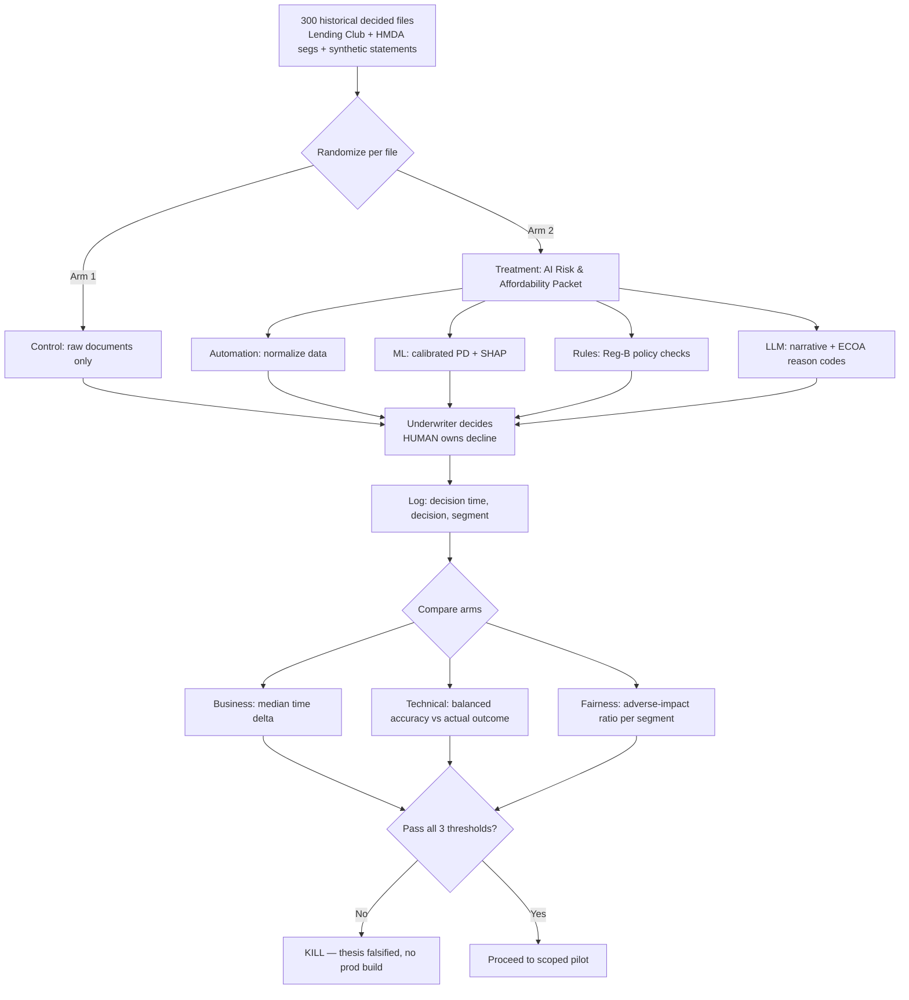

# Credit Decision Co-Pilot: An AI-Prepared Risk & Affordability Packet for Underwriter-in-the-Loop Adjudication — Ideation Package

## Section 1: Nature of the Problem

This sits primarily in the **Decision-Support / Knowledge-Work-Augmentation** category (assembling and summarizing fragmented evidence to support a human expert decision), with a secondary **Compliance-Documentation** category (generating audit-grade adverse-action rationale).

In one sentence: this is a **hybrid — Automation (deterministic ETL + Reg-B credit-policy rules) for the data assembly and threshold checks, Analytics/ML (a calibrated default-risk score) for the quantitative risk signal, and AI/LLM (constrained generation) only for the narrative summarization of bank-statement transactions and the human-readable reason-code prose** — and the LLM is deliberately fenced off from the decision itself.

## Section 1.1: Business Problem (SWAT "So-What")

**Business goal:** Cut the fully-loaded cost-per-decision and increase underwriter throughput in a retail lender's manual underwriting queue, without degrading credit-loss performance or triggering fair-lending liability.

**The so-what:** Underwriters spend the majority of their time *assembling* evidence (downloading bureau pulls, eyeballing 90 days of bank statements for gambling/NSF/undisclosed-debt signals, reconciling stated vs. documented income) rather than *judging* it. Assembly is low-value, slow, and inconsistent between underwriters — the same file gets different treatment depending on who picks it up.

**Specific problem definition:**
- **Scope:** Manually-underwritten unsecured personal/auto loans (the "referred" queue that fails auto-decisioning), roughly the 30% of applications that a human touches.
- **Success:** ≥30% reduction in median underwriter handling time per file AND no statistically detectable increase in default-misclassification AND adverse-impact ratio held ≥0.80 (4/5ths rule) across protected-class proxies.
- **Failure:** Any rise in misclassification of known-bad loans, or any segment's approval ratio dropping below 0.80, or time saving <15%.
- **Timeframe:** 6-week retrospective prototype; decision-quality measured against *already-known* repaid/default outcomes.
- **Metrics:** median seconds-per-file, agreement-with-actual-outcome (balanced accuracy), adverse-impact ratio.

## Section 2: End Users & Expected Workflow

**Primary user:** The manual underwriter (credit analyst) in the referred queue.
**Secondary users:** Compliance/fair-lending officer (audits reason codes), underwriting team lead (monitors disparity dashboard).

**How they use the output:** The underwriter opens a file and, instead of a folder of raw PDFs, sees a one-screen **Risk & Affordability Packet** — pre-summarized, with every claim hyperlinked to its source line so it can be verified or dismissed. The underwriter still reads, still judges, and **owns the decline**. The AI never sets the decision field; it pre-populates evidence and a *suggested* recommendation the human must accept, override, or reject.

**Numbered workflow:**
1. Application hits the referred queue (auto-decisioner abstained).
2. Automation layer pulls and normalizes: bureau file, application form, income docs, 90 days of bank transactions.
3. ML model emits a calibrated probability-of-default + top contributing factors (SHAP).
4. Rules engine runs deterministic Reg-B policy checks (DTI thresholds, policy knockouts) — these, not the LLM, drive any hard-stop reason codes.
5. LLM composes a plain-language packet: evidence summary, flagged signals, reason codes mapped to ECOA-permissible language, and a *suggested* recommendation with confidence.
6. Underwriter reviews on one screen, clicks into any source line to verify, then **decides** (approve/decline/refer-up), optionally editing reason codes.
7. Decision + final reason codes logged immutably for the adverse-action notice and audit trail.

**Example AI-generated output (narrative):**

> **Recommendation: REFER — borderline affordability (confidence: Medium, 0.61).** *This is a suggestion; the underwriter decides.*
> **Affordability:** Documented net monthly income $4,180 (3 consecutive deposits from "ACME LOGISTICS PAYROLL", [statement p.2 L14–16]). Stated income on application was $5,000 — a **$820 (16%) overstatement** [app field 7 vs. bank]. Existing obligations $1,540/mo → back-end DTI **44%** (policy soft-cap 43%, [rule DTI-02]).
> **Risk signals:** 2 NSF fees in 90 days [p.1 L8, p.3 L22]; no gambling/undisclosed-loan patterns detected. Bureau score 662, 1 collection ($310, medical, [bureau seg 4]).
> **Model:** PD 9.4% (calibrated); top factors: DTI (+), recent NSF (+), thin file (+), 4yr employment tenure (−).
> **ECOA reason codes if declined:** R-07 "Income insufficient for amount requested"; R-14 "Level of obligations relative to income." *(Underwriter must confirm; system will not finalize a decline.)*

## Section 3: Business & ROI Evaluation

**How it's addressed today:** Fully manual assembly. An underwriter opens 4–6 source documents per referred file, manually skims statements, computes DTI in a spreadsheet, and writes free-text notes. No standardized reason-code mapping → compliance does rework on adverse-action notices.

**Current performance:** ~25–35 min median handling time per referred file (industry-typical for manual unsecured underwriting); inter-underwriter inconsistency is high; adverse-action notices are a known compliance-rework source.

**Quantified ROI — explicit Fermi build-up (all assumptions stated, mid-size regional lender):**

| Step | Assumption | Value |
|---|---|---|
| A | Total applications/year | 500,000 |
| B | Share referred to manual underwriting | 30% → **150,000 files** |
| C | Current median handling time | 30 min/file |
| D | Fully-loaded underwriter cost (salary+benefits+overhead) | $65/hr = **$1.083/min** |
| E | Current labor cost = B×C×D | 150,000 × 30 × $1.083 = **$4.87M/yr** |
| F | Time reduction from packet (target, conservative) | 30% → saves 9 min/file |
| G | Gross labor savings = B×9×D | 150,000 × 9 × $1.083 = **$1.46M/yr** |
| H | Compliance rework avoided (standardized reason codes): 150k files × 4% notices reworked × 20 min × $1.083 | **$0.13M/yr** |
| I | **Gross annual benefit (G+H)** | **≈ $1.59M/yr** |
| J | Build + run cost: prototype $40k; if productionized, ML/LLM infra + MLOps + fair-lending monitoring | ~$0.45M/yr |
| K | **Net annual benefit (I−J), production** | **≈ $1.14M/yr** |
| L | **Prototype cost to test the whole thesis** | **~$40k, 6 weeks** |

**Traceability note:** The single largest lever is F (time reduction). The prototype exists specifically to falsify F and to prove it doesn't come at the cost of credit quality or fairness. If F is only 15%, gross labor savings halve to ~$0.73M — still positive, but the kill-threshold logic below governs go/no-go.

**Risk-adjusted caveat:** ROI assumes no increase in credit losses. Because manual underwriting decisions a default-loss-bearing book, even a 0.5pp rise in misclassified bad loans could erase the entire labor saving — which is exactly why decision-quality is a gating metric, not a nice-to-have.

## Section 4: Data & Integration

**Specific data items (no vague terms):**
- **Application:** requested amount, term, stated gross income, stated employment status/tenure, declared monthly obligations, loan purpose.
- **Credit bureau (e.g., TransUnion/Experian pull):** FICO/VantageScore, # tradelines, revolving utilization %, # accounts 30/60/90 DPD, public records, collections (amount + type), inquiries last 6mo, oldest-tradeline age.
- **Bank statements (90 days):** per-transaction date, amount, direction, merchant/descriptor string; derived features: count of payroll deposits, mean net monthly inflow, NSF/overdraft count, gambling-merchant txn count, loan-disbursement inflows (undisclosed-debt proxy), end-of-period balance trend.
- **Income docs:** YTD gross, pay frequency, employer name (for cross-check against payroll descriptor).
- **Outcome label (retrospective only):** loan status repaid / charged-off / default — the ground truth.

**Data cleanliness rating: 3/5.** Bureau and application data are structured and clean (4–5). Bank-statement transaction descriptors are the weak link — free-text, inconsistent merchant strings, OCR noise from scanned PDFs, and no standard taxonomy — which is precisely where the LLM/parser earns its place and where most prototype risk lives.

**Deployment model:** Prototype = offline batch on a secured analyst workstation / VPC notebook over de-identified historical files, human-in-the-loop UI is a lightweight web form. No model touches a live decision. Production (out of scope) would be an internal API behind the LOS (loan-origination system), with the LLM in a private/VPC deployment — no applicant data to external endpoints.

## Data Document

**Real, usable sources (public proxies for the prototype — no real applicant data needed to test the thesis):**

1. **Lending Club loan data (2007–2018)** — ~2.2M loans, CSV, ~150 features incl. income, DTI, purpose, FICO range, and **loan_status (Fully Paid / Charged Off)** as the outcome label. Access: Kaggle mirror. PII: none (anonymized). *Role: primary — ML default-risk model + outcome ground truth.*
2. **HMDA Loan Application Register (CFPB, annual)** — tens of millions of mortgage records, public CSV/API, includes applicant **race, ethnicity, sex, geography, action_taken (approved/denied)**. Access: ffiec.cfpb.gov public files. PII: aggregated, no names. *Role: fairness/disparate-impact testing across real protected-class fields — avoids unreliable name/geo proxies.*
3. **Statlog German Credit (UCI)** — 1,000 records, 20 attributes, good/bad label. Access: UCI ML repo. PII: none. *Role: small, fast smoke-test set for the rules+score+narrative pipeline.*
4. **Synthetic bank-statement transaction stream** — generated from templates (payroll descriptors, NSF events, gambling merchants) to exercise the LLM summarizer where no clean public bank-statement corpus exists. PII: none (synthetic). *Role: stress-test the narrative/reason-code generator.*

**Volume for prototype:** N ≈ 300 historical decided files (stratified: approved-repaid, approved-default, declined), enough for a paired time study and a 4/5ths-rule check, small enough to run in days.
**Sensitivity:** Protected-class attributes (HMDA) are used **only** for disparity measurement, held in a segregated table, never fed as model features (avoids disparate treatment).

## Prototype Design

**Single core hypothesis (falsifiable):**
> *Providing underwriters an AI-prepared risk & affordability packet reduces median decision time by ≥30% while keeping agreement-with-actual-outcome statistically non-inferior to the control AND maintaining an adverse-impact ratio ≥0.80 across protected segments.*

If any of the three clauses fails, the hypothesis is falsified.

**The cheap, dirty, disposable test:**
- **N = 300** historical, already-decided applications with known repaid/default outcomes (Lending Club for risk+outcome; HMDA-style segments for fairness; synthetic statements for narrative).
- **Design:** within-subjects A/B. 8–10 real or proxy underwriters each decide a randomized mix of **with-packet** vs **control (raw documents)** files. Counterbalanced so no file is seen twice by the same person.
- **Measured:** stopwatch decision time, their approve/decline vs. the known actual outcome, and approval-rate by segment.
- **Build:** the "packet" is a half-automated, half-manually-curated mock — rules in a spreadsheet/Python, an off-the-shelf LLM API for summaries, a bare web form. No integration, no LOS, no production ML pipeline. **Human-in-the-loop throughout; AI never finalizes.**
- **Fail-fast property:** runnable in 6 weeks for ~$40k. If with-packet decisions agree *less* with actual outcomes, or disparity blows past the 4/5ths line, we kill it before writing a line of production code — the expensive technology was never built.

**WHY THIS IS A PROTOTYPE, NOT A PRODUCT:**
- It runs on **historical, already-decided** files with **known outcomes** — there is no live applicant, no live decision, no real adverse action issued.
- The packet is a **wizard-of-oz-grade mock**: spreadsheet rules + an API call + a bare form. No LOS integration, no MLOps, no monitoring, no scaling, no retraining loop, none of the hardening a product needs.
- It tests the **business case** ("does the packet make humans faster without hurting credit quality or fairness?"), **not the technology** ("can we build a great LLM pipeline?"). The tech is deliberately disposable — we'd throw all of it away and rebuild for production if the thesis survives.
- It is designed to **fail cheaply**: one bad metric and we stop, having spent ~$40k instead of a multi-quarter build.

## Prototype Metrics

**BUSINESS metric (does it deliver value):**
- **Median underwriter handling time per file**, with-packet vs. control. *Target: ≥30% reduction* (e.g., 30 min → ≤21 min). This is the dollar-bearing metric tied directly to Fermi line F/G. Distinct from any technical accuracy number — a model can be accurate and *still not save time* if the packet is unreadable.
- **Secondary:** override rate (how often the underwriter rejects the AI's suggested recommendation) — a usefulness/trust signal; an extreme (near-0% = automation bias, near-100% = packet ignored) is itself a red flag.

**TECHNICAL metrics (precise + reproducible, with targets):**
- **Decision quality:** balanced accuracy of underwriter decisions vs. the **known actual outcome** (default/repaid), with-packet vs. control. *Target: non-inferior — with-packet balanced accuracy ≥ control − 1pp (95% CI).* Reproducible: fixed N=300, fixed label set, fixed metric.
- **Narrative faithfulness:** % of packet claims that are source-verifiable (every dollar figure / flag traces to a real statement line). *Target: ≥95%; hallucinated/unsupported claims ≤5%.*
- **Reason-code validity:** % of generated ECOA reason codes drawn from the approved Reg-B code list and consistent with the cited evidence. *Target: 100% from approved list.*

**KILL THRESHOLD (the specific number that ends the idea):**
The idea is **killed** if ANY of:
1. With-packet **balanced accuracy drops >1pp** below control (decision quality harmed), OR
2. **Adverse-impact ratio <0.80** for any protected segment in the with-packet arm (4/5ths-rule fail), OR
3. **Median time reduction <15%** (value too small to justify the production build + ongoing fair-lending monitoring cost — net ROI no longer defensible), OR
4. **Narrative faithfulness <90%** (too many unsupported claims → unacceptable for adverse-action/audit).

Any single trigger stops the program; we do not "iterate our way" past a fairness or decision-quality failure.

## Responsible-AI Surface (DARWIN-R)

**Bias / fairness:** Disparate impact is the headline risk. We measure the **adverse-impact ratio (4/5ths rule)** across protected segments using real HMDA protected-class fields (not unreliable name/geo proxies, which themselves introduce bias). Protected attributes are used **only for measurement**, never as model features (avoids disparate *treatment*). A <0.80 ratio is a hard kill, not a tuning target. We also test for **proxy leakage** (e.g., zip code standing in for race).

**Privacy / compliance:** Prototype uses anonymized/public/synthetic data — no real applicant PII. Protected-class data lives in a segregated table. Production design keeps the LLM in a private/VPC deployment so no applicant data leaves the lender's boundary; GLBA/FCRA data-handling applies. Bank-statement data is minimized to derived features where possible.

**Explainability to stakeholders:** Two audiences. (1) *Underwriter/applicant* — every adverse-action reason maps to a plain-language, ECOA/Reg-B-permissible code with a cited source line, satisfying the legal requirement to state *specific* reasons for denial. (2) *Compliance/regulator* — calibrated PD with SHAP top-factors, deterministic rule traces, and an immutable decision log make each decision reconstructable. The LLM only *narrates*; it never originates a reason code that isn't backed by a rule or a cited fact.

**Human authority over adverse outcomes:** Non-negotiable and architecturally enforced — **the AI never auto-declines.** It produces a *suggested* recommendation the underwriter must accept, override, or reject; the decision field is human-set; the final reason codes are human-confirmed before any adverse-action notice issues. We monitor override rate to detect **automation bias** (rubber-stamping). The deterministic rules engine — not the LLM — is the only thing that can raise a hard-stop, and even that routes to a human, never to an automated denial.
