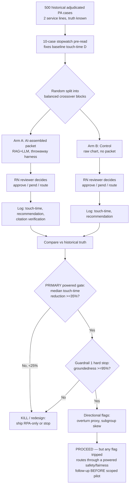

# CareBridge Reviewer-Packet Lift — Ideation Package

> **Step-back note (explicit, per brief).** Our group's prior submission, *CareBridge*, is a full seven-agent decision-intelligence **product** with a 3-year $16.8M value model. That document answers "what should we build?" This package deliberately does **not**. It isolates the *one* assumption the whole $1.6M product rests on — that an AI-assembled packet actually makes a human reviewer faster without making them less safe — and proposes a disposable 3-4 week, ~$35K test that can kill the program before a single production dollar is committed. If the packet doesn't move reviewer touch-time, every downstream agent, FHIR integration, and ROI line in the product report is moot. We test that hinge first.

---

## Section 1: Nature of the Problem

This is primarily a **decision-support / augmentation** problem (Section-1 category: *expert-judgment augmentation under a human-authority constraint*), with a secondary **process-efficiency / cost-reduction** category.

In one sentence: the core value-add we are testing is **AI** (RAG-grounded LLM reasoning that synthesizes unstructured clinical evidence against medical-necessity criteria into a reviewer-ready narrative) — explicitly **not** Automation (the deterministic eligibility/code/benefit checks are RPA and stay out of scope of this test) and **not** Analytics (no forecasting or BI dashboard is being validated here).

---

## Section 1.1: Business Problem (SWAT "So-What")

**Business goal:** reduce the fully-loaded cost of utilization-management (UM) labor and free clinical reviewer capacity without degrading clinical safety or regulatory standing.

**So-what, sharpened:** A mid-market regional payer adjudicates ~650K PA/yr at a ~$22 blended handling cost. The expensive, slow, and clinically sensitive segment is the human-reviewed tail — the cases a licensed UM nurse must touch. Today the nurse spends most of that touch-time **assembling and reconciling** evidence (pulling notes, finding the applicable policy version, checking which criteria are met) rather than **deciding**. We assert — and must prove — that pre-assembling that packet with AI converts assembly time into decision time and removes 35-45% of touch-time per reviewed case.

**Specific problem framing (falsifiable, scoped, timed):**
- **Scope:** the human-reviewed PA segment only (estimated ~60% of volume ≈ 390K cases/yr); two service lines for the test (advanced imaging + specialty pharmacy), because they dominate review volume and have stable published criteria.
- **One primary, powered success metric:** median reviewer touch-time per case falls **≥35%** versus control. This is the value metric — the only number that converts to money.
- **Safety guardrails (hard stops on the primary, *not* co-equal hypotheses):** packet **groundedness ≥95%** (a hard stop — powered at this N), and the reviewer-disagreement / **overturn proxy stays ≤5%** (a *directional* safety flag at this N — see Power note for why it cannot be a statistical kill at N=500).
- **Failure definition:** primary fails if touch-time reduction **<25%**; the build is independently vetoed if **groundedness < the safety bar**; an overturn-proxy rise is a directional red flag that **triggers a larger powered safety study before any pilot**, not an in-test kill.
- **Timeframe:** decision in 4 weeks from data pull.
- **Metrics:** touch-time (min/case), reviewer-AI/reviewer-truth concordance, packet groundedness, overturn proxy.

---

## Section 2: End Users & Expected Workflow

**Primary user:** the **licensed UM nurse reviewer** (RN). Secondary: the **medical director** (owns all denials/partial denials). Tertiary (read-only): UM operations manager tracking SLA and capacity.

The reviewer does not consume a "score." They consume a **decision packet** — evidence + the policy criteria checklist with each criterion marked met/unmet/uncertain and cited to source + a recommendation of *approve / pend-for-info / route-for-clinical-review*. The AI never denies; "route-for-review" is the most adverse action it can take.

**Workflow (numbered):**
1. PA request lands in the worklist (via X12 278 or portal); deterministic layer (out of test scope) confirms eligibility, codes, network, benefit.
2. AI retrieves the patient's relevant evidence and the **applicable, version-pinned** medical-necessity policy.
3. AI maps evidence → each policy criterion, citing the exact source span for every assertion.
4. AI assembles the packet and assigns a recommendation with rationale.
5. **Reviewer opens the packet**, verifies citations, confirms or overrides the recommendation. This is the only step whose duration we are trying to compress.
6. If recommendation is approve and reviewer agrees → approve. If pend → standardized info request auto-drafted. If route-for-review → escalates to medical director, who owns any denial.
7. Every assertion, citation, recommendation, and human action is written to an immutable audit log.

**Example AI-generated packet narrative (specialty-pharmacy case):**

> **Request:** Adalimumab (HCPCS J0135), member age 41, dx moderate-to-severe rheumatoid arthritis (ICD-10 M06.9).
> **Policy applied:** Plan Medical Policy RX-1142 **v4.2 (effective 2026-01-15)** — biologic DMARD step-therapy.
> **Criteria assessment:**
> - ✅ *Confirmed RA diagnosis by rheumatologist* — **Met.** Source: Consult note 2026-03-02, Dr. Rao, "seropositive RA." [note_id 88231, p.1]
> - ✅ *≥3-month trial + inadequate response to ≥1 conventional DMARD (methotrexate)* — **Met.** Source: Med history shows methotrexate 2025-09 → 2026-02 (5 mo); progress note 2026-02-18 "persistent synovitis, DAS28 5.1." [rx_claim 7741; note_id 90114]
> - ⚠️ *Negative TB screening within 12 months* — **Uncertain.** No QuantiFERON/PPD result located in supplied records. **Recommend PEND for TB screening result.**
> **Recommendation:** **PEND-FOR-INFO** (single missing item: TB screen). Not a denial. All approval criteria met except one documentation gap.
> **Confidence:** policy-mapping high; evidence-completeness medium (1 unresolved item).

The value the reviewer perceives: steps 1-4 are already done and *traceable*; she spends her minute verifying the TB-screen gap, not hunting through five notes to reconstruct the methotrexate trial.

---

## Section 3: Business & ROI Evaluation

**How it's handled today:** a UM nurse manually opens the chart, locates notes/labs/med history across systems, finds and reads the applicable policy, and reconciles the two by hand before deciding. Current state: median standard TAT ~3.5 business days; first-pass documentation completeness ~62%; appeal-overturn ~5%. There is no standard packaging tool, so evidence assembly is inconsistent reviewer-to-reviewer.

**Current "accuracy":** the human baseline is the gold standard for *correctness* (the overturn rate of ~5% is the system's error proxy); the deficiency is *efficiency and consistency*, not decision quality.

### Fermi ROI build-up (every assumption stated; this is the value the prototype is gating)

| # | Assumption | Value | Source / basis |
|---|---|---|---|
| A | PA volume / yr | 650,000 | Domain brief |
| B | Share reaching a human UM reviewer | 60% (ranged **50-70%**) | Assumption (auto-approve/auto-route handles rest); **most sensitive lever — carried as a band, not a point** |
| C | Human-reviewed cases / yr (A×B) | 390K (325K-455K) | Derived |
| D | Baseline reviewer touch-time / case | **14 min — PROVISIONAL** | **External anchor required (see note below). The entire $4.10M base, and therefore every ROI figure here, hinges on this single number.** |
| E | UM nurse fully-loaded cost | $45 / hr = $0.75/min | Mid-market RN loaded rate assumption |
| F | Baseline reviewer labor / case (D×E) | $10.50 | Derived (provisional with D) |
| G | Annual reviewer labor (C×F, at B=60%) | **$4.10M** | Derived (provisional with D) |
| H | Target touch-time reduction | 35% (low end of 35-45% claim) | Hypothesis (primary endpoint) |
| I | Gross annual labor saving (G×H) | **$1.43M** | Derived |
| J | Annual run cost after build | **$0.25-0.45M (mid $0.35M)** | **Bottom-up decomposition, below — not a prior deck** |
| K | Build cost (one-time) | **$1.2-2.0M (mid $1.6M) → $0.40-0.67M/yr amortized over 3 yr** | **Bottom-up decomposition, below — not a prior deck** |
| L | Net annual value at 35% reduction (I − J − K_amort) | **~$0.55M point (B=60%, mid cost); band ~$0.1M-$0.9M** | Derived — see sensitivity |
| M | Net annual value at 45% reduction | **~$0.96M point (B=60%, mid cost); band ~$0.4M-$1.5M** | Derived — see sensitivity |

**Anchor for D (replaces the earlier circular back-check).** The previous draft "back-checked" D=14 min against the same ~$22 blended handling cost it is supposed to be independent of — D and the $22 figure were each propping up the other, which is circular and inadmissible. We remove that reasoning entirely. D must be set from a source *outside* the cost model:
- **Preferred:** a published UM / utilization-review time-motion basis. We do **not** assert a specific citation here, so we do not claim D=14 as established.
- **Therefore, gating step (cheap, fast, runs before the main test):** a **10-case stopwatch PRE-READ** — one analyst times ten real human-reviewed cases end-to-end (worklist-open → decision-submit) to fix D empirically. Cost is ~1 analyst-day, inside the $35K envelope. **Until that pre-read lands, every ROI figure in this section (G, I, L, M) is explicitly PROVISIONAL.** If the pre-read returns D materially below ~11 min, the program is underwater at the low end before the packet test even runs, and we stop there.

**Bottom-up cost decomposition (replaces "Product report Table 21 / midpoint" — a CFO cannot gate a build on the proponent's own prior number).** These are planning-grade ranges to be firmed by a vendor RFP, deliberately independent of the product deck:

| Run cost J (annual) | Range | | Build cost K (one-time) | Range |
|---|---|---|---|---|
| On-prem inference compute (PHI-side retrieval/embedding GPU) | $80-120K | | RAG+LLM packet-assembly pipeline dev | $0.4-0.7M |
| Managed LLM API (de-identified criterion summaries, ~390K cases) | $40-80K | | FHIR/X12 integration + policy version-pinning engine | $0.4-0.6M |
| MLOps + model monitoring (0.5-1.0 loaded FTE) | $90-180K | | Clinical-safety validation + HIPAA/compliance | $0.2-0.4M |
| Integration upkeep + immutable audit tooling | $40-70K | | PM + contingency | $0.2-0.3M |
| **Total run** | **$0.25-0.45M** | | **Total build** | **$1.2-2.0M** |

**Sensitivity (the honest CFO view).** Net annual value is a *band*, not a point, driven by three independent uncertainties — the human-touch lever B (50-70%), the cost band (low-high), and D (pending pre-read):

| Reduction | Net @ low cost, B=70% | Net @ mid cost, B=60% | Net @ high cost, B=50% |
|---|---|---|---|
| 35% (kill floor +) | ~$1.07M | ~$0.55M | ~$0.04M |
| 45% (upside) | ~$1.55M | ~$0.96M | ~$0.36M |

**Reading of the model (the punchline for the CFO):** the program is **not** comfortably profitable at the low end — at 35% reduction, mid cost, the net is ~$0.55M/yr, and at the pessimistic corner (high build cost, B=50%) it is roughly break-even. The whole investment case lives in the gap between 35% and 45% and in lever B, and collapses below ~25%. **That is precisely why a $35K prototype must gate a build whose midpoint is $1.6M.** Breakeven touch-time reduction (I = J + K_amort) sits near ~21.5% at the mid case; we set the kill threshold conservatively above it at 25%.

---

## Section 4: Data & Integration

**Specific data items (no vague "patient data"):**
- **Request envelope:** member ID, plan ID, requesting provider NPI, urgency flag, requested service code (CPT/HCPCS), diagnosis (ICD-10-CM), service line.
- **Clinical evidence:** physician progress/consult notes (free text), discharge summaries, structured labs (LOINC-coded with value + date), medication/rx-claim history (NDC, fill dates), imaging report text.
- **Policy corpus:** the plan's medical-necessity policy documents, **each with version ID and effective date**; CMS NCD/LCD where applicable; step-therapy and AUC criteria as discrete checklist items.
- **Outcome labels (for the test only):** the historical final adjudicated decision, any appeal, and any overturn — these are the ground truth the prototype scores against.

**Data cleanliness rating: 3 / 5.** Structured fields (codes, claims, labs) are clean and reliable (~4-5). The two load-bearing inputs are messier: clinical notes are unstructured, abbreviation-heavy, and OCR-contaminated where faxed (~2-3); and the policy corpus suffers **version drift** — multiple overlapping policy editions where pinning the *applicable* version is itself error-prone (~3). The 3/5 is set by these two, because they are exactly what the AI layer must handle and what could fail silently.

**Deployment model:** **on-prem / VPC-isolated for all PHI.** Retrieval, embedding, and packet assembly over raw PHI run inside the payer boundary on self-hosted compute. Only **de-identified, structured criterion-level summaries** (e.g., "criterion 2: 5-month methotrexate trial documented, inadequate response") are sent to a managed LLM for the reasoning/narrative step. No raw note, name, or MRN ever leaves the boundary.

---

## Data Document

For the **real test**, the data is the payer's own historical adjudicated PA cases (PHI, on-prem) — ~500 cases, structured + note PDFs, accessed via the data warehouse under a HIPAA limited-data-set agreement; sensitivity: **high (PHI)**, handled on-prem only.

For **prototype development and any externally shareable demo**, use these named public proxies so no PHI is needed to build the throwaway harness:

| Source | What it proxies | Volume / format | Access path | PII / sensitivity |
|---|---|---|---|---|
| **MIMIC-IV** + **MIMIC-IV-Note** (PhysioNet) | Real de-identified clinical notes, labs, discharge summaries | ~300K admissions; ~2M notes; CSV + text | PhysioNet credentialed access + CITI training | De-identified; DUA required; **moderate** |
| **CMS Medicare Coverage Database (NCD/LCD)** | Medical-necessity criteria corpus, version-dated | Thousands of policies; HTML/XML | Public, mcd.cms.gov | None; public |
| **CMS HCPCS + ICD-10-CM + CPT mappings** | Service/diagnosis code validation | Full code sets; CSV | Public CMS downloads (CPT via AMA license) | None / license |
| **Synthea (synthetic FHIR)** | End-to-end plumbing + edge cases without any real PHI | Generate N on demand; FHIR JSON | Open-source, run locally | None; synthetic |
| **X12 278 sample transactions** | PA request/response envelope format | Sample set; EDI | WEDI / vendor samples | None; sample |

Proprietary criteria engines (InterQual, MCG) are intentionally **excluded** — we use open CMS NCD/LCD + AUC as the criteria proxy so the prototype carries no licensing dependency.

---

## Prototype Design

**The single primary hypothesis (one powered, falsifiable endpoint):**

> **H (primary):** An AI-assembled decision packet reduces a UM nurse's median touch-time per reviewed case by **≥35%** versus the no-packet control.

That is the value metric and the *only* co-equal kill clause. Two safety conditions ride alongside it as **guardrails — not as the hypothesis**:

> **Guardrail 1 (hard stop, powered):** packet **groundedness ≥95%**. Measured per *assertion* across ~500 packets → thousands of assertions, so it is tightly estimable at this N. A groundedness failure vetoes the build regardless of how good the touch-time number is — speed bought with fabrication is not a tradeoff we are allowed to make.
> **Guardrail 2 (directional flag, under-powered at this N):** **overturn proxy ≤5%**. At N=500 a rare ~5% event cannot be statistically confirmed non-inferior (see Power note); a rise here is a **red flag that triggers a powered safety study**, not an in-test kill.

This is the unbundling the panel asked for: one statistically-powered value endpoint, with safety demoted to guardrails — one a hard stop because it is powered, one a directional trigger because it is not.

### Statistical Power / Minimum Detectable Effect (honest note)

What N=500 crossover cases / 6 RN reviewers **can** detect:
- **Touch-time (primary):** continuous, within-case paired (each case reviewed with and without packet by different reviewers), low residual variance. With ~500 paired observations the design is well-powered to detect a touch-time shift far smaller than the 35% we require — this endpoint is genuinely powered, and the 25% kill line is a confident statistical call.
- **Groundedness (Guardrail 1):** unit of analysis is the *assertion*, not the case; thousands of assertions yield a tight confidence interval around the 95% bar. Powered → kept as a hard stop.

What this N **cannot** support, and what we do about it:
- **Overturn proxy (Guardrail 2):** baseline ~5% is a rare event. Detecting a true rise from 5% → ~8% with adequate power needs **thousands** of cases per arm; at 500 split across arms a handful of flips swamps the estimate. So overturn **cannot be a statistical kill here.** We demote it to a **directional red flag → triggers a powered, prospective non-inferiority safety study (≈3,000-5,000 cases, or shadow-mode) before any pilot.**
- **Subgroup fairness:** stratifying 500 cases by age band × sex × payer line fragments into small cells, underpowered for a credible differential-quality test. Reported as a **directional flag only → triggers a powered fairness sub-study** in the same follow-up. Honest, and it keeps fail-fast intact: we kill cheaply on the powered metrics and refuse to *pretend* the cheap test settled the rare-event safety questions.

**The cheap, dirty, disposable test:**
- **N = ~500** historical, already-adjudicated cases (truth known) from 2 service lines. Retrospective, so zero patient risk.
- **Crossover design, 6 RN reviewers:** each case is reviewed once *with* packet and once *without* by **different** reviewers, balanced so no reviewer sees the same case twice and each reviewer does both arms. This controls for case difficulty and reviewer speed — the cheapest way to get a clean within-subject signal at small N.
- **Wizard-of-Oz where it's cheaper than building:** the deterministic retrieval (eligibility/codes/benefit) is **stubbed or hand-fed**, because it's known-good and not what we're testing. Only the RAG+LLM packet-assembly layer is real, built as a throwaway harness — no UI polish, no EHR integration, notes pasted in, packets rendered as static documents.
- **Pre-read first:** the 10-case stopwatch pre-read (Section 3) fixes D *before* the main run, so the ROI the test gates is anchored, not circular.
- **Measure:** (1) timestamped touch-time per case; (2) reviewer's recommendation vs the historical adjudicated truth (concordance, and overturn proxy = reviewer-with-packet flips that historical truth would have overturned); (3) clinician-verified packet groundedness (does every cited assertion check out).
- **Fail-fast:** ~3-4 weeks, ~$35K. A null or negative touch-time result, or a groundedness failure, **kills the ~$1.6M program** at <2.5% of its midpoint build cost. That asymmetry is the whole point.

**Why RAG+LLM here and not rules/RPA (right-tool check):** the deterministic 60-70% of PA work — eligibility, code validity, network status, benefit lookup, policy-version selection — is **better and cheaper as RPA/rules**, and we deliberately keep it out of the LLM and out of this test. The LLM earns its place on exactly one thing: reasoning across *unstructured* notes to decide whether a *narrative* criterion ("inadequate response to a conventional DMARD") is met, and articulating that with citations a nurse can verify in seconds. Rules cannot read "persistent synovitis, DAS28 5.1" and map it to a criterion; RPA cannot generate a defensible, cited rationale. If the prototype shows the LLM layer doesn't add touch-time value over the deterministic packet alone, the correct answer is to **not buy the LLM** and ship RPA only — and the prototype is designed to reveal exactly that.

**WHY THIS IS A PROTOTYPE, NOT A PRODUCT:** it touches no live PA, integrates with no EHR, has no UI, automates no decision, and is thrown away win or lose. It uses retrospective cases with known answers so it can be *graded*, not *deployed*. It validates the **business case** (does pre-assembly buy reviewer time safely?) — not the technology (it ignores latency, scaling, MLOps, the other six product agents, and FHIR plumbing). It is built to **fail fast and cheap**: one harness, six reviewers, four weeks, $35K, against a ~$1.6M go/no-go. It deliberately does **not** try to settle the rare-event safety questions it is too small to settle — it flags them for a powered follow-up instead.

---

## Prototype Metrics

**BUSINESS metric (the decision number — in dollars, distinct from any technical measurement):**
- **Projected NET ANNUAL VALUE ($) at the observed touch-time reduction**, computed by feeding the test's measured reduction back through the Fermi model, with the sensitive lever **B (human-touch share) carried as a 50-70% band** and the bottom-up cost ranges applied — yielding a value *band*, not a single figure (Section 3 sensitivity table). This is what a CFO gates the build on. A technically perfect packet that produces a negative net-value band has zero business value, which is why this is a money figure and not minutes.
- Decision rule on this metric: proceed only if the **mid-case net annual value is comfortably positive AND the pessimistic corner (high cost, B=50%) is at least break-even.**

**TECHNICAL metrics (precise + reproducible instrumentation, with targets):**
- **Median touch-time per case (minutes)** — pure instrumentation, from worklist-open timestamp to decision-submit timestamp; reported with IQR; reproducible because it's machine-logged, not self-reported. This feeds the business metric above but is *not itself* the business claim — it is the raw signal the dollar figure is derived from.
- **Packet groundedness / faithfulness:** % of packet assertions whose cited source span a blinded clinician confirms supports the claim. Target **≥95%**; equivalently **hallucination rate ≤5%**, and **zero** fabricated criterion-satisfaction.
- **Recommendation concordance with adjudicated truth:** precision/recall of the AI's *approve* recommendations against historical *approve* outcomes. Target **approve-precision ≥95%** (an AI "approve" that truth would have pended/denied is the dangerous error).
- **Overturn proxy:** rate at which a packet-assisted reviewer reaches a decision that historical appeal data shows would be overturned. Target **≤5%** — measured and reported, but read as a directional flag (see Power note), not a powered result.

**KILL thresholds, correctly tiered:**
- **Primary kill (powered):** **median touch-time reduction < 25%** ends the idea outright — below the ~21.5% Fermi breakeven plus margin, the build cannot clear its own cost (Section 3). This is a confident statistical call at N=500.
- **Guardrail hard stop (powered):** **groundedness < 95%** vetoes the build regardless of the efficiency result — any safety regression on faithfulness voids the program. Powered because the unit is the assertion (thousands), not the case.
- **Directional trigger (under-powered, not an in-test kill):** an **overturn-proxy rise > 5%** or a **subgroup-quality skew** does not by itself kill or pass the idea at this N; it **forces a powered prospective safety/fairness study before any pilot dollar is spent.** Calling these "kills" at N=500 would be statistical theatre; this tiering is the honest version and keeps fail-fast intact.

---

## Responsible-AI Surface (DARWIN-R)

**Bias / fairness.** The most dangerous failure is not the model inventing bias — it is the model *learning historical denial bias as truth*. Because the prototype scores recommendations against past adjudicated outcomes, any demographic skew in historical denials would be silently rewarded as "accuracy." Mitigation: (1) stratify the 500-case sample and report touch-time and concordance **by age band, sex, and payer line (Medicaid vs commercial)** — but treat this as a **directional fairness flag only, because the per-cell N is too small for a powered differential test** (Power note); (2) treat the historical label as the *efficiency* benchmark only, never as the *fairness* benchmark; (3) any flag here **triggers the powered fairness sub-study** in the follow-up rather than being waved through or falsely "cleared" by an underpowered prototype.

**Privacy / compliance (HIPAA).** PHI never leaves the on-prem boundary; only de-identified, structured criterion summaries reach the managed LLM. The test uses a HIPAA **limited data set** under DUA; public development uses MIMIC (de-identified, credentialed) and Synthea (synthetic). No raw note, name, or MRN in any LLM prompt. Audit log is immutable and access-controlled.

**Explainability to stakeholders.** Every packet assertion carries a **source citation (note ID + span)** and an explicit met/unmet/uncertain status — a reviewer or auditor can trace any recommendation to evidence in seconds, which is also what makes the touch-time saving real rather than a black-box "trust me" score. For the medical director and compliance, the packet *is* the explanation.

**Human authority over adverse outcomes.** Hard constraint, enforced by design: the AI's most adverse possible action is **route-for-review** or **pend-for-info**. It cannot deny or partially deny. Every denial and partial denial is owned by a licensed clinician with independent judgment, and the prototype measures whether the packet *helps* that human decide faster — never whether it can replace them. The groundedness hard stop and the overturn directional trigger exist specifically to guarantee that augmentation never quietly becomes unsafe automation — and we are explicit that the rare-event safety verdict is owed to a powered follow-up, not claimed from a 500-case prototype.
